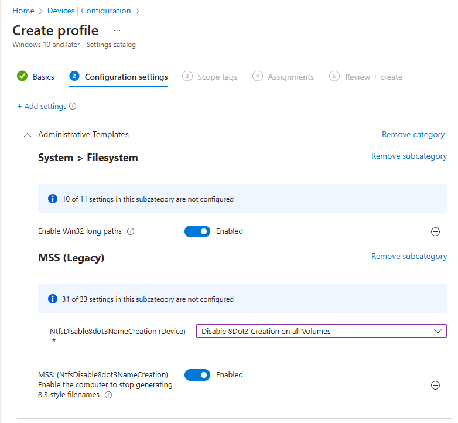

# Custom Administrative Templates (ADMX & ADML)

This repository includes some custom Administrative Templates that can be used on your on-prem environment or Microsoft Intune.

> [!CAUTION]
> [Ingesting](https://petervanderwoude.nl/post/deep-dive-ingesting-third-party-admx-files/) (or [importing](https://learn.microsoft.com/en-us/mem/intune-service/configuration/administrative-templates-import-custom)) custom templates of [Microsoft Windows](https://github.com/janparttimaa/custom-administrative-templates/tree/main/Microsoft%20Windows) are currently not working on Microsoft Intune due to the fact that [Microsoft is currently blocking](https://learn.microsoft.com/en-us/windows/client-management/win32-and-centennial-app-policy-configuration#a-href-idoverviewaoverview) registry entries where custom policies are applying registry keys. Otherwise, the GPOs are working normally as they should be.

## OMA-URI of ADMX-templates
Here you can see OMA-URI information for released ADMX-templates, that can be deployed via Intune using ingestion.

| ADMX-template | OMA-URI |
|---------------|---------|
| Adobe Digital Editions | ```./Device/Vendor/MSFT/Policy/ConfigOperations/ADMXInstall/AdobeDigitalEditions/Policy/AdobeDigitalEditionsAdmx``` |
| 7-Zip | ```./Device/Vendor/MSFT/Policy/ConfigOperations/ADMXInstall/7-Zip/Policy/7-ZipAdmx``` |
| VLC | ```./Device/Vendor/MSFT/Policy/ConfigOperations/ADMXInstall/VLC/Policy/VLCAdmx``` |
| WinSCP | ```./Device/Vendor/MSFT/Policy/ConfigOperations/ADMXInstall/WinSCP/Policy/WinSCPAdmx``` |
| iManage | ```./Device/Vendor/MSFT/Policy/ConfigOperations/ADMXInstall/iManage/Policy/iManageAdmx``` |

## OMA-URI of settings
Here you can see OMA-URI information of the settings that are part of these ADMX-templates, that can be deployed via Intune using ingestion with ingested ADMX-templates.

### Adobe Digital Editions
| Name | Description | OMA-URI | Data type | Recommended Value 
|---------|---------|---------|---------|---------|
| ```DoNotInstallAntivirus``` | (See below) | ```./Device/Vendor/MSFT/Policy/Config/AdobeDigitalEditions~Policy~AdobeDigitalEditions/DoNotInstallAntivirus``` | String | ```<enabled/>```

#### Description (DoNotInstallAntivirus)
During installation of Adobe Digital Edition, the installer might ask you to install antivirus product (e.g. Norton, Symantec etc.) or trial one of those products.

**Recommended:** If you enable this setting, Adobe Digital Edition will not pop up and ask you to install antivirus product into endpoint device running 64-bit Microsoft Windows operating system. This request will be automatically declined. Enabling this policy is required and necessary when deploying Adobe Digital Edition to be available either via Intune Company Portal or Software Center to all users or selected users.

If you disable this setting, Adobe Digital Edition will pop up and ask you to install antivirus product. You can manually either accept or decline the request.

> [!NOTE]  
> If you want to disable the setting via Intune, please make sure that value is then set to ```<disabled/>```

If you not configure this setting, Adobe Digital Edition might pop up and ask you to install antivirus product depending what setting you have previously set. You can manually either accept or decline the request, if you get the request.

#### Technical information
- **Friendly name of the setting:** Do not offer Antivirus program installation
- **Registry Hive:** HKEY_LOCAL_MACHINE
- **Registry Path:** SOFTWARE\Wow6432Node\Symantec\NPInstaller\DeclineCount\adobeebook
- **Value Type:** REG_DWORD
- **Value Name:** ns
- **Enabled Value:** 3
- **Disabled Value:** 0

### 7-Zip
| Name | Description | OMA-URI | Data type | Recommended Value 
|---------|---------|---------|---------|---------|
| ```Lang``` | (See below) | ```./User/Vendor/MSFT/Policy/Config/7-Zip~Policy~7-Zip/Lang``` | String | ```<enabled/> <data id="Lang" value="-"/>```

#### Description (Lang)
Set and enforce language of the 7-Zip.

If you want to set language, enable this policy and set prefferred language. If user changes preferred language to something else from 7-Zip's settings, language will be enforced back to preferred language next time when device's policy refresh cycle starts. 

Please check language values in this table below:
<br>_(List updated 22 March 2025)_

| Language | Value | More information
|---------|---------|---------|
| English | ```-``` | This is default language. |
| Afrikaans | ```af``` ||
| Albanian | ```sq``` ||
| Arabic | ```ar``` ||
| Aragonese | ```an``` ||
| Armenian | ```hy``` ||
| Asturian | ```ast``` ||
| Azerbaijani | ```az``` ||
| Bangla | ```bn``` ||
| Bashkir | ```ba``` ||
| Basque | ```eu``` ||
| Belarusian | ```be``` ||
| Breton | ```br``` ||
| Bulgarian | ```bg``` ||
| Catalan | ```ca``` ||
| Chinese Simplified | ```zh-cn``` ||
| Chinese Traditional | ```zh-tw``` ||
| Corsican | ```co``` ||
| Croatian | ```hr``` ||
| Czech | ```cs``` ||
| Danish | ```da``` ||
| Dutch | ```nl``` ||
| Esperanto | ```eo``` ||
| Estonian | ```et``` ||
| Extremaduran | ```ext``` ||
| Farsi | ```fa``` ||
| Finnish | ```fi``` ||
| French | ```fr``` ||
| Frisian | ```fy``` ||
| Friulian | ```fur``` ||
| Galician | ```gl``` ||
| Georgian | ```ka``` ||
| German | ```de``` ||
| Greek | ```el``` ||
| Gujarati, Indian | ```gu``` ||
| Hebrew | ```he``` ||
| Hindi, Indian | ```hi``` ||
| Hungarian | ```hu``` ||
| Icelandic | ```is``` ||
| Ido | ```io``` ||
| Indonesian | ```id``` ||
| Irish | ```ga``` ||
| Italian | ```it``` ||
| Japanese | ```ja``` ||
| Kabyle | ```kab``` ||
| Karakalpak - Latin | ```kaa``` ||
| Kazakh | ```kk``` ||
| Korean | ```ko``` ||
| Kurdish | ```ku``` ||
| Kurdish - Sorani | ```ku-ckb``` ||
| Kyrgyz | ```ky``` ||
| Latvian | ```lv``` ||
| Ligurian | ```lij``` ||
| Lithuanian | ```lt``` ||
| Macedonian | ```mk``` ||
| Malay | ```ms``` ||
| Marathi | ```mr``` ||
| Mongolian (MenkCode) | ```mng2``` ||
| Mongolian (Unicode) | ```mng``` ||
| Mongolian | ```mn``` ||
| Nepali | ```ne``` ||
| Norwegian Bokmal | ```nb``` ||
| Norwegian Nynorsk | ```nn``` ||
| Pashto | ```ps``` ||
| Polish | ```pl``` ||
| Portugese Brazilian | ```pt-br``` ||
| Portugese Portugal | ```pt``` ||
| Punhabi, Indian | ```pa-in``` ||
| Romanian | ```ro``` ||
| Russian | ```ru``` ||
| Sanskrit, Indian | ```sa``` ||
| Serbian - Cyrillic | ```sr-spc``` ||
| Serbian - Latin | ```sr-spl``` ||
| Sinhala | ```si``` ||
| Slovak | ```sk``` ||
| Slovenian | ```sl``` ||
| Spanish | ```es``` ||
| Swahili | ```sw``` ||
| Swedish | ```sv``` ||
| Tajik | ```tg``` ||
| Tamil | ```ta``` ||
| Tatar | ```tt``` ||
| Thai | ```th``` ||
| Turkish | ```tr``` ||
| Turkmen | ```tk``` ||
| Ukranian | ```uk``` ||
| Uyghur | ```ug``` ||
| Uzbek | ```uz``` ||
| Uzbek - Cyrillic | ```uz-cyrl``` ||
| Valencian | ```va``` ||
| Vietnamese | ```vi``` ||
| Welsh | ```cy``` ||
| Yoruba | ```yo``` ||

If you disable or not configure this setting, user can choose preferred language from 7-Zip's settings and we will not enforce user to use specific language.

> [!NOTE]  
> If you want to disable the setting via Intune, please make sure that value is then set to ```<disabled/>```

#### Technical information
- **Friendly name of the setting:** Set language
- **Registry Hive:** HKEY_CURRENT_USER
- **Registry Path:** SOFTWARE\7-Zip
- **Value Type:** REG_SZ
- **Value Name:** Lang
- **Enabled Value:** ```-```
- **Disabled Value:** ```-```

### VLC
| Name | Description | OMA-URI | Data type | Recommended Value 
|---------|---------|---------|---------|---------|
| ```Lang``` | (See below) | ```./User/Vendor/MSFT/Policy/Config/VLC~Policy~VLC/Lang``` | String | ```<enabled/> <data id="Lang" value="en"/>```

#### Description (Lang)
Set and enforce language of the VLC.

If you want to set language, enable this policy and set prefferred language. If user changes preferred language to something else from VLC's settings, language will be enforced back to preferred language next time when device's policy refresh cycle starts. 

Please check language values in this table below:
<br>_(List updated 22 March 2025)_

| Language | Value | More information
|---------|---------|---------|
| American English | ```en``` | This is recommended language. |
| Arabic | ```ar``` |  |
| Aragonese | ```an``` |  |
| Assamese, Indian | ```as_IN``` |  |
| Asturian | ```ast``` |  |
| Basque | ```eu``` |  |
| Belarusian | ```be``` |  |
| Bengali, Bangla | ```bn``` |  |
| Bodo | ```brx``` |  |
| British English | ```en_GB``` |  |
| Bulgarian | ```bg``` |  |
| Cambodian | ```km``` |  |
| Catalan | ```ca``` |  |
| Chinese Simplified | ```zh_CN``` |  |
| Chinese Traditional | ```zh_TW``` |  |
| Corsican | ```co``` |  |
| Croatian | ```hr``` |  |
| Czech | ```cs``` |  |
| Danish | ```da``` |  |
| Dutch | ```nl``` |  |
| Estonian | ```et``` |  |
| Finnish | ```fi``` |  |
| French | ```fr``` |  |
| Gaelic (Scots Gaelic) | ```gd``` |  |
| Galician | ```gl``` |  |
| German | ```de``` |  |
| Greek | ```el``` |  |
| Gujarati, Indian | ```gu``` |  |
| Hebrew | ```he``` |  |
| Hungarian | ```hu``` |  |
| Icelandic | ```is``` |  |
| Indonesian | ```id``` |  |
| Irish | ```ga``` |  |
| Italian | ```it``` |  |
| Japanese | ```ja``` |  |
| Kannada | ```kn``` |  |
| Kazakh | ```kk``` |  |
| Korean | ```ko``` |  |
| Latvian | ```lv``` |  |
| Lithuanian | ```lt``` |  |
| Malay | ```ms``` |  |
| Marathi | ```mr``` |  |
| Nepali | ```ne``` |  |
| Norwegian Bokmal | ```nb``` |  |
| Norwegian Nynorsk | ```nn``` |  |
| Occitan | ```oc``` |  |
| Polish | ```pl``` |  |
| Portugese Brazilian | ```pt_BR``` |  |
| Portugese Portugal | ```pt_PT``` |  |
| Punhabi, Indian | ```pa``` |  |
| Romanian | ```ro``` |  |
| Russian | ```ru``` |  |
| Serbian - Cyrillic | ```sr``` |  |
| Sinhala | ```si``` |  |
| Slovak | ```sk``` |  |
| Slovenian | ```sl``` |  |
| Spanish | ```es``` |  |
| Spanish Mexico | ```es_MX``` |  |
| Swedish | ```sv``` |  |
| Thai | ```th``` |  |
| Turkish | ```tr``` |  |
| Ukranian | ```uk``` |  |
| Vietnamese | ```vi``` |  |
| Walloon | ```wa``` |  |
| Welsh | ```cy``` |  |

If you disable or not configure this setting, user can choose preferred language from VLC's settings and we will not enforce user to use specific language.

> [!NOTE]  
> If you want to disable the setting via Intune, please make sure that value is then set to ```<disabled/>```

#### Technical information
- **Friendly name of the setting:** Set language
- **Registry Hive:** HKEY_CURRENT_USER
- **Registry Path:** SOFTWARE\VideoLAN\VLC
- **Value Type:** REG_SZ
- **Value Name:** Lang
- **Enabled Value:** ```en```
- **Disabled Value:** ```en```

### WinSCP
| Name | Description | OMA-URI | Data type |  Possible Values
|---------|---------|---------|---------|---------|
| ```BetaVersions``` | (See below) | ```./User/Vendor/MSFT/Policy/Config/WinSCP~Policy~WinSCP/BetaVersions``` | String | ```<enabled/> <data id="BetaVersions_Dropdown" value="2"/>```<br><br>```<enabled/> <data id="BetaVersions_Dropdown" value="1"/>```<br><br>```<enabled/> <data id="BetaVersions_Dropdown" value="0"/>```<br><br>```<disabled/>```
| ```Period``` | (See below) | ```./User/Vendor/MSFT/Policy/Config/WinSCP~Policy~WinSCP/Period``` | String | ```<enabled/> <data id="Period_Dropdown" value="0"/>```<br><br>```<enabled/> <data id="Period_Dropdown" value="1"/>```<br><br>```<enabled/> <data id="Period_Dropdown" value="7"/>```<br><br>```<enabled/> <data id="Period_Dropdown" value="30"/>```<br><br>```<disabled/>```
| ```ShowOnStartup``` | (See below) | ```./User/Vendor/MSFT/Policy/Config/WinSCP~Policy~WinSCP/ShowOnStartup``` | String | ```<enabled/>```<br><br>```<disabled/>```

#### Description (BetaVersions)
Set and enforce setting "Check for beta versions" of the WinSCP.

If you want to check beta versions of the WinSCP or makes sure that checking beta versions are entirely disabled, enable this policy and choose preferred value. If user change the preferred setting and value from WinSCP's settings, setting and value will be enforced back to be preffered setting and value next time when device's policy refresh cycle starts.

- Value "Auto" makes WinSCP check for beta releases, only if you ever have used any beta release before. This option is available in stable releases only. Beta releases report newer beta releases always. 
- Value "Off" disables check for beta releases. If you are centrally mass deploying WinSCP using e.g. Microsoft Intune or Configuration Manager, you should choose this setting. This is also recommended setting if you don't want to use beta releases.
- Value "On" enables check for beta releases.

Here are these values translated to numeric values for Intune-deployment:

| Value (GPO) | Value (Intune) |
|---------|---------|
| Auto | 2 |
| Off | 1 |
| On | 0 |

If you disable or not configure this setting, user can choose preferred choice from WinSCP's settings and we will not enforce user to use specific value of the setting.

> [!NOTE]  
> If you want to disable the setting via Intune, please make sure that value is then set to ```<disabled/>```

#### Technical information
- **Friendly name of the setting:** [Updates] Check for beta versions
- **Registry Hive:** HKEY_CURRENT_USER
- **Registry Path:** SOFTWARE\Martin Prikyl\WinSCP 2\Configuration\Interface\Updates
- **Value Type:** REG_DWORD
- **Value Name:** BetaVersions
- **Enabled Values:**
    - **Auto:** 2
    - **Off:** 1
    - **On:** 0
- **Disabled Value:** N/A

> [!NOTE]  
> N/A in this context means that registry key is not existed.

#### Description (Period)
If you want to set automatic update period, enable this policy and set prefferred period. If user changes preferred period to something else from WinSCP's settings, period will be enforced back to preferred period next time when device's policy refresh cycle starts.

- Value "Never" disables automatic update check. If you are centrally mass deploying WinSCP using e.g. Microsoft Intune or Configuration Manager, you should enable and choose this setting.
- Value "Daily" checks updates once per day.
- Value "Weekly" checks updates once per week.
- Value "Monthly" checks updates once per month.

Here are these values translated to numeric values for Intune-deployment:

| Value (GPO) | Value (Intune) |
|---------|---------|
| Never | 0 |
| Daily | 1 |
| Weekly | 7 |
| Monthly | 30 |

If you disable or not configure this setting, user can choose preferred period from WinSCP's settings and we will not enforce user to use specific period.

> [!NOTE]  
> If you want to disable the setting via Intune, please make sure that value is then set to ```<disabled/>```

#### Technical information
- **Friendly name of the setting:** [Updates] Automatic check period
- **Registry Hive:** HKEY_CURRENT_USER
- **Registry Path:** SOFTWARE\Martin Prikyl\WinSCP 2\Configuration\Interface\Updates
- **Value Type:** REG_DWORD
- **Value Name:** Period
- **Enabled Values:**
    - **None:** 0
    - **Daily:** 1
    - **Weekly:** 7
    - **Monthly:** 30
- **Disabled Value:** N/A

> [!NOTE]  
> N/A in this context means that registry key is not existed.

#### Description (ShowOnStartup)
If you want to display information about pending software update on the startup of WinSCP, enable this policy. If user disbales the setting from WinSCP's settings, setting will be enforced back to be enabled next time when device's policy refresh cycle starts.

If you disable this setting, user cannot see pending software update on the startup of WinSCP.  If you are centrally mass deploying WinSCP using e.g. Microsoft Intune or Configuration Manager, you should disable this setting.

If you not configure this setting, user can choose preferred choice from WinSCP's settings and we will not enforce user to use specific value of the setting.

> [!NOTE]  
> If you want to disable the setting via Intune, please make sure that value is then set to ```<disabled/>```

#### Technical information
- **Friendly name of the setting:** [Updates] Display information about update on startup
- **Registry Hive:** HKEY_CURRENT_USER
- **Registry Path:** SOFTWARE\Martin Prikyl\WinSCP 2\Configuration\Interface\Updates
- **Value Type:** REG_DWORD
- **Value Name:** ShowOnStartup
- **Enabled Value:** 1
- **Disabled Value:** 0

### iManage
| Name | Description | OMA-URI | Data type |  Recommended Value
|---------|---------|---------|---------|---------|
| ```Auto Download Update``` | (See below) | ```./User/Vendor/MSFT/Policy/Config/iManage~Policy~iManage/AutoDownloadUpdate``` | String | ```<enabled/>```
| ```Selected Update Channel``` | (See below) | ```./Device/Vendor/MSFT/Policy/Config/iManage~Policy~iManage/SelectedUpdateChannel``` | String | ```<enabled/> <data id="SelectedUpdateChannel" value="release"/>```
 
> [!NOTE]  
> iManage mandates, that following additional settings needs to configured, especially when using iManage Drive: <br><br>
> 
 
#### Description (Auto Download Update)
You can specify whether updates should be downloaded and installed automatically. This setting ensures that if there are any updates, they're automatically downloaded and installed on the user's device. This provides a seamless and quicker installation experience for users.

If you enable this policy, The "Automatically download and install updates" option is selected by default on the "Update Settings" screen of iManage Agent Services and users cannot disable it.

If you not configure this setting, user can manage itself this setting adn we are not managing or enforcing it.

> [!NOTE]  
> If you want to disable the setting via Intune, please make sure that value is then set to ```<disabled/>```

#### Technical information
- **Friendly name of the setting:** Automatically download and install updates
- **Registry Hive:** HKEY_CURRENT_USER
- **Registry Path:** SOFTWARE\iManage\WorkAgent\AutoUpdate
- **Value Type:** REG_DWORD
- **Value Name:** Auto Download Update
- **Enabled Value:** 1
- **Disabled Value:** 0

#### Description (Selected Update Channel)
Setting auto update channel to iManage.

iManage Work Agent provides the ability to switch between the update channels. Depending on how they are configured in your environment, you may be able to see and select different update channels. To use this feature and select preferred update channel to all users, enable this policy and select preferred update channel.

Please check available values for auto update channel in this table below:
<br>_(List updated 5 April 2025)_

| Channel | Value | More information
|---------|---------|---------|
| Release Work 10 / Release Work 10 with Drive | ```release``` | **<li> This is recommended channel.**<br><li> This channel is supported to iManage Work 10 and iManage Drive. |
| Coming Soon Work 10 / Coming Soon Work 10 with Drive | ```coming_soon``` | <li> This channel is supported to iManage Work 10 and iManage Drive.  |
| Release Work 10 with DeskSite | ```release_compatibility``` | <li> This channel is only supported to iManage Work 10.  |
| Release Work 10 with FileSite | ```release_compatibility_fs``` | <li> This channel is only supported to iManage Work 10.  |
| Release Work 10.7.1 | ```release_1071``` | <li> This channel is only supported to iManage Work 10.  |
| Coming Soon Work 10 with DeskSite | ```coming_soon_compatibility``` | <li> This channel is only supported to iManage Work 10.  |
| Coming Soon Work 10 with FileSite | ```coming_soon_compatibility_fs``` | <li> This channel is only supported to iManage Work 10. |

If you disable or not configuring this setting, user can itself select preferred update channel from iManage Work Agent settings.

> [!NOTE]  
> If you want to disable the setting via Intune, please make sure that value is then set to ```<disabled/>```

#### Technical information
- **Friendly name of the setting:** Automatically download and install updates
- **Registry Hive:** HKEY_LOCAL_MACHINE
- **Registry Path:** SOFTWARE\iManage\AgentServices\AutoUpdate
- **Value Type:** REG_SZ
- **Value Name:** Selected Update Channel
- **Enabled Values:**
    - **Release Work 10 / Release Work 10 with Drive:** release
    - **Coming Soon Work 10 / Coming Soon Work 10 with Drive:** coming_soon
    - **Release Work 10 with DeskSite:** release_compatibility
    - **Release Work 10 with FileSite:** release_compatibility_fs
    - **Release Work 10.7.1:** release_1071
    - **Coming Soon Work 10 with DeskSite:** coming_soon_compatibility
    - **Coming Soon Work 10 with FileSite:** coming_soon_compatibility_fs
- **Disabled Value:** N/A

> [!NOTE]  
> N/A in this context means that registry key is not existed.